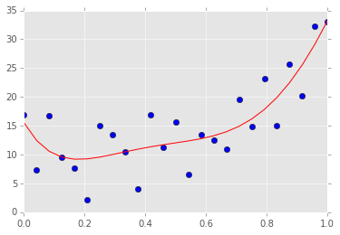

```python
import os
import sys
import glob
import matplotlib.pyplot as plt
import numpy as np
import pandas as pd
%matplotlib inline
%precision 4
plt.style.use('ggplot')
```


```python
%install_ext http://raw.github.com/jrjohansson/version_information/master/version_information.py
```

    Installed version_information.py. To use it, type:
      %load_ext version_information


参考文献
----

- [Basics of numpy](http://scipy-lectures.github.io/intro/numpy/index.html)
- [Some numpy exercises](http://scipy-lectures.github.io/intro/numpy/exercises.html)
- [Advanced numpy](http://scipy-lectures.github.io/advanced/advanced_numpy/)
- [Numpy reference](http://docs.scipy.org/doc/numpy/reference/)
- [Numpy for Matlab users](http://wiki.scipy.org/NumPy_for_Matlab_Users)
- [Numpy for R users](http://mathesaurus.sourceforge.net/r-numpy.html)
- [Tutorials on Pandas](http://pandas.pydata.org/pandas-docs/stable/tutorials.html)
- [Blaze documentation](http://blaze.pydata.org/docs/dev/index.html)

样例
----

本节内容参考 <http://scipy-lectures.github.io/intro/numpy/exercises.html#data-statistics>

这个文件[populations.txt](http://scipy-lectures.github.io/_downloads/populations.txt) 中的数据描述了二十年内的野兔和猞猁(和胡萝卜)在加拿大北部的数量。

基于这个文件中的数据，对下列值进行计算，并用print打印输出

- 这段时间内每个物种的平均值和方差
- 每个物种数量最多是哪一年
- 每年哪一种物种数量最多 (提示：可以使用np的索引： np.array(['H', 'L', 'C']))
- 哪一年中有任意一种动物的数量超过50000 (提示：对比以及使用 np.any)
- 每种物种数量最低的两年是哪两年(提示：可以使用argsort,fancy indexing)
- 使用图形对比野兔数量（参考 np.gradient)和猞猁的数量，检查这两者是否具有相关性（参考np.corrcoefl)

... 以上全部内容都不允许使用 for 循环


```python
# 当然要先把数据下载到本地了，这里使用的是wget
if not os.path.exists('populations.txt'):
    ! wget http://scipy-lectures.github.io/_downloads/populations.txt
```


```python
# 简单看一下文件，看看数据的结构
! head -n 6 populations.txt
```

    # year	hare	lynx	carrot
    1900	30e3	4e3	48300
    1901	47.2e3	6.1e3	48200
    1902	70.2e3	9.8e3	41500
    1903	77.4e3	35.2e3	38200
    1904	36.3e3	59.4e3	40600


```python
# 把数据加载到np.array数组中
data = np.loadtxt('populations.txt').astype('int')
data[:5, :]
```


    array([[ 1900, 30000,  4000, 48300],
           [ 1901, 47200,  6100, 48200],
           [ 1902, 70200,  9800, 41500],
           [ 1903, 77400, 35200, 38200],
           [ 1904, 36300, 59400, 40600]])


```python
# 设定合适的变量名
populations = data[:, 1:]
year, hare, lynx, carrot = data.T
```


```python
# 这一段时间中每个物种的数量平均值以及标准差：
print "Mean (hare, lynx, carrot):", populations.mean(axis=0)
print "Std (hare, lynx, carrot):", populations.std(axis=0)
```

    Mean (hare, lynx, carrot): [ 34080.9524  20166.6667  42400.    ]
    Std (hare, lynx, carrot): [ 20897.9065  16254.5915   3322.5062]


```python
# 每个物种各自哪一年到达最大数量
print "Year with largest population (hare, lynx, carrot)",
print year[np.argmax(populations, axis=0)]
```

    Year with largest population (hare, lynx, carrot) [1903 1904 1900]


```python
# 每年哪一个物种的数量最大
species = ['hare', 'lynx', 'carrot']
zip(year, np.take(species, np.argmax(populations, axis=1)))
```


    [(1900, 'carrot'),
     (1901, 'carrot'),
     (1902, 'hare'),
     (1903, 'hare'),
     (1904, 'lynx'),
     (1905, 'lynx'),
     (1906, 'carrot'),
     (1907, 'carrot'),
     (1908, 'carrot'),
     (1909, 'carrot'),
     (1910, 'carrot'),
     (1911, 'carrot'),
     (1912, 'hare'),
     (1913, 'hare'),
     (1914, 'hare'),
     (1915, 'lynx'),
     (1916, 'carrot'),
     (1917, 'carrot'),
     (1918, 'carrot'),
     (1919, 'carrot'),
     (1920, 'carrot')]


```python
# 哪一年中任意物种数量超过50000
print year[np.any(populations > 50000, axis=1)]
```

    [1902 1903 1904 1912 1913 1914 1915]


```python
# 每种物种数量最低的两年
print year[np.argsort(populations, axis=0)[:2]]
```

    [[1917 1900 1916]
     [1916 1901 1903]]


```python
plt.plot(year, lynx, 'r-', year, np.gradient(hare), 'b--')
plt.legend(['lynx', 'grad(hare)'], loc='best')
print np.corrcoef(lynx, np.gradient(hare))
```

    [[ 1.     -0.9179]
     [-0.9179  1.    ]]


Python 中的数值计算
====

### NDArray

在 `numpy` 中最基础的结构就是 `ndarray`，是用来表示向量/矩阵/更高维度数组d。每一个`ndarray`都有下面的属性：

- dtype = 对应了在 C语言中的数据类型
- shape = array 数组的数值维度
- strides = 遍历数组时候，每个方向上的二进制值的步长（number of bytes to step in each direction when traversing the array）


```python
x = np.array([1,2,3,4,5,6])
print x
print 'dytpe', x.dtype
print 'shape', x.shape
print 'strides', x.strides
```

    [1 2 3 4 5 6]
    dytpe int64
    shape (6,)
    strides (8,)


```python
x.shape = (2,3)
print x
print 'dytpe', x.dtype
print 'shape', x.shape
print 'strides', x.strides
```

    [[1 2 3]
     [4 5 6]]
    dytpe int64
    shape (2, 3)
    strides (24, 8)


```python
x = x.astype('complex')
print x
print 'dytpe', x.dtype
print 'shape', x.shape
print 'strides', x.strides
```

    [[ 1.+0.j  2.+0.j  3.+0.j]
     [ 4.+0.j  5.+0.j  6.+0.j]]
    dytpe complex128
    shape (2, 3)
    strides (48, 16)


### 创建数组


```python
# 从列表list生成数组
x_list = [(i,j) for i in range(2) for j in range(3)]
print x_list, '\n'
x_array = np.array(x_list)
print x_array
```

    [(0, 0), (0, 1), (0, 2), (1, 0), (1, 1), (1, 2)]

    [[0 0]
     [0 1]
     [0 2]
     [1 0]
     [1 1]
     [1 2]]


```python
# 使用特定函数来生成数组

print np.ones((3,2)), '\n'
print np.zeros((3,2)), '\n'
print np.eye(3), '\n'
print np.diag([1,2,3]), '\n'
print np.fromfunction(lambda i, j: (i-2)**2+(j-2)**2, (5,5))
```

    [[ 1.  1.]
     [ 1.  1.]
     [ 1.  1.]]

    [[ 0.  0.]
     [ 0.  0.]
     [ 0.  0.]]

    [[ 1.  0.  0.]
     [ 0.  1.  0.]
     [ 0.  0.  1.]]

    [[1 0 0]
     [0 2 0]
     [0 0 3]]

    [[ 8.  5.  4.  5.  8.]
     [ 5.  2.  1.  2.  5.]
     [ 4.  1.  0.  1.  4.]
     [ 5.  2.  1.  2.  5.]
     [ 8.  5.  4.  5.  8.]]


### 数组索引


```python
# 创建一个 10 * 6 的数组，基于正态分布，然后转换成 int 值
n, nrows, ncols = 100, 10, 6
xs = np.random.normal(n, 15, size=(nrows, ncols)).astype('int')
xs
```


    array([[ 82,  94,  86, 114,  88, 115],
           [104,  84, 103,  87,  86,  96],
           [105,  87,  72, 113,  82, 104],
           [124, 103,  79,  88, 128,  87],
           [111, 101, 104, 104,  90,  82],
           [ 94, 110,  89,  89, 112,  97],
           [132, 122, 102, 108,  93, 108],
           [ 89,  80, 112,  96, 107,  73],
           [128, 104,  99, 107,  98, 132],
           [100,  73,  92,  92, 117,  99]])


```python
# 使用切片标示符号
print(xs[0,0])
print(xs[-1,-1])
print(xs[3,:])
print(xs[:,0])
print(xs[::2,::2])
print(xs[2:5,2:5])
```

    82
    99
    [124 103  79  88 128  87]
    [ 82 104 105 124 111  94 132  89 128 100]
    [[ 82  86  88]
     [105  72  82]
     [111 104  90]
     [132 102  93]
     [128  99  98]]
    [[ 72 113  82]
     [ 79  88 128]
     [104 104  90]]


```python
#  对整数列表进行索引
print(xs[0, [1,2,4,5]])
```

    [ 94  86  88 115]


```python
# 布尔值进行索引（Boolean indexing）
print(xs[xs % 2 == 0])
xs[xs % 2 == 0] = 0 # 设置每个值都为0
print(xs)
```

    [ 82  94  86 114  88 104  84  86  96  72  82 104 124  88 128 104 104  90
      82  94 110 112 132 122 102 108 108  80 112  96 128 104  98 132 100  92
      92]
    [[  0   0   0   0   0 115]
     [  0   0 103  87   0   0]
     [105  87   0 113   0   0]
     [  0 103  79   0   0  87]
     [111 101   0   0   0   0]
     [  0   0  89  89   0  97]
     [  0   0   0   0  93   0]
     [ 89   0   0   0 107  73]
     [  0   0  99 107   0   0]
     [  0  73   0   0 117  99]]


```python
# 导出下三角矩阵，对角矩阵，上三角矩阵

a = np.arange(16).reshape(4,4)
print a, '\n'
print np.tril(a, -1), '\n'
print np.diag(np.diag(a)), '\n'
print np.triu(a, 1)
```

    [[ 0  1  2  3]
     [ 4  5  6  7]
     [ 8  9 10 11]
     [12 13 14 15]]

    [[ 0  0  0  0]
     [ 4  0  0  0]
     [ 8  9  0  0]
     [12 13 14  0]]

    [[ 0  0  0  0]
     [ 0  5  0  0]
     [ 0  0 10  0]
     [ 0  0  0 15]]

    [[ 0  1  2  3]
     [ 0  0  6  7]
     [ 0  0  0 11]
     [ 0  0  0  0]]


### 广播（Broadcasting）, 行/列和矩阵运算（row, column，matrix operations）


```python
# 对整个矩阵或者其中的各个行或者列来进行计算
print(xs.max())
print(xs.max(axis=0)) # 每列最大值
print(xs.max(axis=1)) # 每行最大值
```

    117
    [111 103 103 113 117 115]
    [115 103 113 103 111  97  93 107 107 117]


```python
# 不使用面向对象的方法，而使用函数也能实现
print(np.max(xs, axis=0))
print(np.max(xs, axis=1))
```

    [111 103 103 113 117 115]
    [115 103 113 103 111  97  93 107 107 117]


```python
# 广播broadcasting
xs = np.arange(12).reshape(2,6)
print(xs, '\n')
print(xs * 10, '\n')

# 广播直接就能适用于进行列操作的情况
col_means = xs.mean(axis=0)
print(col_means, '\n')
print(xs + col_means, '\n')

# 但用到行操作的时候就要稍微麻烦一点
row_means = xs.mean(axis=1)[:, np.newaxis]
print(row_means)
print(xs + row_means)
```

    (array([[ 0,  1,  2,  3,  4,  5],
           [ 6,  7,  8,  9, 10, 11]]), '\n')
    (array([[  0,  10,  20,  30,  40,  50],
           [ 60,  70,  80,  90, 100, 110]]), '\n')
    (array([ 3.,  4.,  5.,  6.,  7.,  8.]), '\n')
    (array([[  3.,   5.,   7.,   9.,  11.,  13.],
           [  9.,  11.,  13.,  15.,  17.,  19.]]), '\n')
    [[ 2.5]
     [ 8.5]]
    [[  2.5   3.5   4.5   5.5   6.5   7.5]
     [ 14.5  15.5  16.5  17.5  18.5  19.5]]


```python
# 对矩阵进行转换，使其平均值为零，然后将标准差使用列的总体统计来进行标准化
print((xs - xs.mean(axis=0))/xs.std(axis=0))
```

    [[-1. -1. -1. -1. -1. -1.]
     [ 1.  1.  1.  1.  1.  1.]]


```python
# 对矩阵进行转换，使其平均值为零，然后将标准差使用行的总体统计来进行标准化
print((xs - xs.mean(axis=1)[:, np.newaxis])/xs.std(axis=1)[:, np.newaxis])
```

    [[-1.4639 -0.8783 -0.2928  0.2928  0.8783  1.4639]
     [-1.4639 -0.8783 -0.2928  0.2928  0.8783  1.4639]]


```python
# 用外积进行广播（broadcasting for outer product）
# 例如：创建一个 12x12 的乘法表
u = np.arange(1, 13)
u[:,None] * u[None,:]
```


    array([[  1,   2,   3,   4,   5,   6,   7,   8,   9,  10,  11,  12],
           [  2,   4,   6,   8,  10,  12,  14,  16,  18,  20,  22,  24],
           [  3,   6,   9,  12,  15,  18,  21,  24,  27,  30,  33,  36],
           [  4,   8,  12,  16,  20,  24,  28,  32,  36,  40,  44,  48],
           [  5,  10,  15,  20,  25,  30,  35,  40,  45,  50,  55,  60],
           [  6,  12,  18,  24,  30,  36,  42,  48,  54,  60,  66,  72],
           [  7,  14,  21,  28,  35,  42,  49,  56,  63,  70,  77,  84],
           [  8,  16,  24,  32,  40,  48,  56,  64,  72,  80,  88,  96],
           [  9,  18,  27,  36,  45,  54,  63,  72,  81,  90,  99, 108],
           [ 10,  20,  30,  40,  50,  60,  70,  80,  90, 100, 110, 120],
           [ 11,  22,  33,  44,  55,  66,  77,  88,  99, 110, 121, 132],
           [ 12,  24,  36,  48,  60,  72,  84,  96, 108, 120, 132, 144]])


#### 样例：使用 broadcasting 和 vectorization 计算间距矩阵（pairwise distance matrix）

计算下面的各个点的距离矩阵

- (0,0)
- (4,0)
- (4,3)
- (0,3)


```python
def distance_matrix_py(pts):
    """返回欧几里德距离矩阵，纯Python版本"""
    n = len(pts)
    p = len(pts[0])
    m = np.zeros((n, n))
    for i in range(n):
        for j in range(n):
            s = 0
            for k in range(p):
                s += (pts[i,k] - pts[j,k])**2
            m[i, j] = s**0.5
    return m
```


```python
def distance_matrix_np(pts):
    """返回欧几里德距离矩阵，使用向量的numpy版本"""
    return np.sum((pts[None,:] - pts[:, None])**2, -1)**0.5
```


```python
pts = np.array([(0,0), (4,0), (4,3), (0,3)])
```


```python
distance_matrix_py(pts)
```


    array([[ 0.,  4.,  5.,  3.],
           [ 4.,  0.,  3.,  5.],
           [ 5.,  3.,  0.,  4.],
           [ 3.,  5.,  4.,  0.]])


```python
distance_matrix_np(pts)
```


    array([[ 0.,  4.,  5.,  3.],
           [ 4.,  0.,  3.,  5.],
           [ 5.,  3.,  0.,  4.],
           [ 3.,  5.,  4.,  0.]])


```python
# Broaccasting 和 vectorization 的速度远远比循环要快得多
%timeit distance_matrix_py(pts)
%timeit distance_matrix_np(pts)
```

    1000 loops, best of 3: 199 µs per loop
    10000 loops, best of 3: 31.4 µs per loop


### 通用函数（Universal functions ，Ufuncs）

那些既能够处理标量（scalars)也能处理数组（arrays）的函数就叫做通用函数。对于数组，通用函数会对每个元素来进行运算处理。在计算向量的时候，通用函数的使用是非常重要的，而且通常比针对每个元素来使用for循环要在计算上效率更高。


```python
xs = np.linspace(0, 2*np.pi, 100)
ys = np.sin(xs) # np.sin 就是一个通用函数（universal function）
plt.plot(xs, ys);
```


```python
# 默认情况下运算符也会对所有元素来进行操作

xs = np.arange(10)
print xs
print -xs
print xs+xs
print xs*xs
print xs**3
print xs < 5
```

    [0 1 2 3 4 5 6 7 8 9]
    [ 0 -1 -2 -3 -4 -5 -6 -7 -8 -9]
    [ 0  2  4  6  8 10 12 14 16 18]
    [ 0  1  4  9 16 25 36 49 64 81]
    [  0   1   8  27  64 125 216 343 512 729]
    [ True  True  True  True  True False False False False False]


### 广义通用函数（Generalized ufucns）

一个通用函数会对一组标量(scalars)按向量的方式进行遍历循环。而一个广义通用函数则会对一组向量或者一批数组进行遍历。目前numpy只提供了一种广义通用函数。不过这也已经很重要，尤其是在带有`numba`的 JIT （just in time 即时）编译的情况下，这个我们会在以后的章节中讲到。


```python
from numpy.core.umath_tests import matrix_multiply

print matrix_multiply.signature
```

    (m,n),(n,p)->(m,p)


```python
us = np.random.random((5, 2, 3)) # 5 2x3 matrics
vs = np.random.random((5, 3, 4)) # 5 3x4 matrices
# 对五个矩阵集合中的所有元素都进行矩阵乘法
ws = matrix_multiply(us, vs)
print ws.shape
print ws
```

    (5, 2, 4)
    [[[ 0.9421  1.2886  0.6542  0.9562]
      [ 0.7672  1.1319  0.546   0.8148]]

     [[ 0.4471  0.5582  0.3671  0.1876]
      [ 0.3807  0.3593  0.3259  0.1457]]

     [[ 0.5528  0.5151  0.5762  0.7216]
      [ 0.8859  0.954   0.9029  0.7181]]

     [[ 0.2883  0.6539  0.1948  0.4289]
      [ 0.2639  0.6634  0.1931  0.3793]]

     [[ 0.4788  0.4683  0.9784  0.4239]
      [ 0.8316  0.8722  1.316   1.1181]]]


### 随机数

有两个模块，都能生成（伪）随机数，这种伪随机数是非常常用的。你只需要使用某种分布来生成随机值，最简单的就是使用 `numpy.random`。如果需要相关分布的更多信息，例如分位数（quantiles）或者 PDF，就需要用 `scipy.stats`这个模块。

#### 使用 `numpy.random`

[Module Reference](http://docs.scipy.org/doc/numpy/reference/routines.random.html)


```python
import numpy.random as npr
npr.seed(123) # 设定随机数结果的种子（seed for reproducible results）
```


```python
# 摇一个六面色子100次，其中10次的值（10 trials of rolling a fair 6-sided 100 times）
roll = 1.0/6
x = npr.multinomial(100, [roll]*6, 10)
x
```


    array([[18, 14, 14, 18, 20, 16],
           [16, 25, 16, 14, 14, 15],
           [15, 19, 16, 12, 18, 20],
           [19, 13, 14, 18, 18, 18],
           [18, 20, 17, 16, 16, 13],
           [15, 16, 15, 16, 20, 18],
           [12, 17, 17, 18, 17, 19],
           [15, 16, 22, 21, 13, 13],
           [18, 12, 16, 17, 22, 15],
           [14, 17, 25, 15, 15, 14]])


```python
# 在二维面上的均匀分布（uniformly distributed numbers in 2D）
x = npr.uniform(-1, 1, (100, 2))
plt.scatter(x[:,0], x[:,1], s=50)
plt.axis([-1.05, 1.05, -1.05, 1.05]);
```


```python
# 随机洗牌生成一个向量（ranodmly shuffling a vector）
x = np.arange(10)
npr.shuffle(x)
x
```


    array([5, 8, 6, 4, 3, 9, 1, 7, 2, 0])


```python
# 随即变换（radnom permutations）
npr.permutation(10)
```


    array([1, 4, 9, 8, 6, 5, 3, 2, 0, 7])


```python
# 不替换的随机选取（radnom selection without replacement）
x = np.arange(10,20)
npr.choice(x, 10, replace=False)
```


    array([14, 16, 15, 12, 19, 11, 13, 10, 18, 17])


```python
# 带替换的随机选取（radnom selection with replacement）
npr.choice(x, (5, 10), replace=True) # replace=True是默认的
```


    array([[15, 13, 10, 14, 18, 14, 19, 13, 15, 11],
           [18, 10, 19, 11, 15, 18, 18, 14, 16, 18],
           [17, 19, 12, 10, 10, 19, 19, 15, 13, 15],
           [15, 12, 12, 17, 13, 11, 13, 19, 13, 16],
           [12, 13, 11, 19, 18, 10, 12, 13, 17, 19]])


```python
# 玩具样例：估计圆周率（estimating pi inefficiently）
n = 1e6
x = npr.uniform(-1,1,(n,2))
4.0*np.sum(x[:,0]**2 + x[:,1]**2 < 1)/n
```


    3.1416


#### 使用 scipy.stats

[Module refernce](http://docs.scipy.org/doc/scipy-0.14.0/reference/stats.html)


```python
import scipy.stats as stats
```


```python
# 创建一个"frozen"分布，例如一个部分应用的函数(distribution - i.e. a partially applied function)
dist = stats.norm(10, 2)
```


```python
# 和rnorm一样(same as rnorm)
dist.rvs(10)
```


    array([ 11.629 ,   9.5777,   8.5607,   8.5777,   8.6464,  11.5398,
            10.8751,  11.8244,  10.1772,   9.3056])


```python
# same as pnorm
dist.pdf(np.linspace(5, 15, 10))
```


    array([ 0.0088,  0.0301,  0.076 ,  0.141 ,  0.1919,  0.1919,  0.141 ,
            0.076 ,  0.0301,  0.0088])


```python
# same as dnorm
dist.cdf(np.linspace(5, 15, 11))
```


    array([ 0.0062,  0.0228,  0.0668,  0.1587,  0.3085,  0.5   ,  0.6915,
            0.8413,  0.9332,  0.9772,  0.9938])


```python
# same as qnorm
dist.ppf(dist.cdf(np.linspace(5, 15, 11)))
```


    array([  5.,   6.,   7.,   8.,   9.,  10.,  11.,  12.,  13.,  14.,  15.])


### 线性代数（Linear algebra）

通常情况下，线性代数的函数都可以在scipy.linalg中找到。此外还可以使用BLAS 和 LAPACK 函数，这需要使用  scipy.linagl.blas 和 scipy.linalg.lapack。


```python
import scipy.linalg as la
```


```python
A = np.array([[1,2],[3,4]])
b = np.array([1,4])
print(A)
print(b)
```

    [[1 2]
     [3 4]]
    [1 4]


```python
# 矩阵运算
import numpy as np
import scipy.linalg as la
from functools import reduce

A = np.array([[1,2],[3,4]])
print(np.dot(A, A))
print(A)
print(la.inv(A))
print(A.T)
```

    [[ 7 10]
     [15 22]]
    [[1 2]
     [3 4]]
    [[-2.   1. ]
     [ 1.5 -0.5]]
    [[1 3]
     [2 4]]


```python
x = la.solve(A, b) # 不要使用 x = dot(inv(A), b)因为这样效率很低，而且可靠性也不行
print(x)
print(np.dot(A, x) - b)
```

    [ 2.  -0.5]
    [ 0.  0.]


### 矩阵分解（Matrix decompositions）


```python
A = np.floor(npr.normal(100, 15, (6, 10)))
print(A)
```

    [[  94.   82.  125.  108.  105.   88.   99.   82.   97.  112.]
     [  83.  124.   67.  103.   73.  111.  125.   81.  122.   62.]
     [  93.   84.  107.  107.   80.   85.   96.   89.   85.  102.]
     [ 116.  116.   64.   98.   82.   98.  121.   70.  122.   98.]
     [ 118.  108.  103.  102.   68.   98.   88.   78.  103.   95.]
     [ 112.  115.   74.   80.  106.  104.  114.  105.   80.   99.]]


```python
P, L, U = la.lu(A)
print(np.dot(P.T, A))
print
print(np.dot(L, U))
```

    [[ 118.  108.  103.  102.   68.   98.   88.   78.  103.   95.]
     [  83.  124.   67.  103.   73.  111.  125.   81.  122.   62.]
     [  94.   82.  125.  108.  105.   88.   99.   82.   97.  112.]
     [ 116.  116.   64.   98.   82.   98.  121.   70.  122.   98.]
     [ 112.  115.   74.   80.  106.  104.  114.  105.   80.   99.]
     [  93.   84.  107.  107.   80.   85.   96.   89.   85.  102.]]

    [[ 118.  108.  103.  102.   68.   98.   88.   78.  103.   95.]
     [  83.  124.   67.  103.   73.  111.  125.   81.  122.   62.]
     [  94.   82.  125.  108.  105.   88.   99.   82.   97.  112.]
     [ 116.  116.   64.   98.   82.   98.  121.   70.  122.   98.]
     [ 112.  115.   74.   80.  106.  104.  114.  105.   80.   99.]
     [  93.   84.  107.  107.   80.   85.   96.   89.   85.  102.]]


```python
Q, R = la.qr(A)
print(A)
print
print(np.dot(Q, R))
```

    [[  94.   82.  125.  108.  105.   88.   99.   82.   97.  112.]
     [  83.  124.   67.  103.   73.  111.  125.   81.  122.   62.]
     [  93.   84.  107.  107.   80.   85.   96.   89.   85.  102.]
     [ 116.  116.   64.   98.   82.   98.  121.   70.  122.   98.]
     [ 118.  108.  103.  102.   68.   98.   88.   78.  103.   95.]
     [ 112.  115.   74.   80.  106.  104.  114.  105.   80.   99.]]

    [[  94.   82.  125.  108.  105.   88.   99.   82.   97.  112.]
     [  83.  124.   67.  103.   73.  111.  125.   81.  122.   62.]
     [  93.   84.  107.  107.   80.   85.   96.   89.   85.  102.]
     [ 116.  116.   64.   98.   82.   98.  121.   70.  122.   98.]
     [ 118.  108.  103.  102.   68.   98.   88.   78.  103.   95.]
     [ 112.  115.   74.   80.  106.  104.  114.  105.   80.   99.]]


```python
U, s, V = la.svd(A)
m, n = A.shape
S =  np.zeros((m, n))
for i, _s in enumerate(s):
    S[i,i] = _s
print(reduce(np.dot, [U, S, V]))
```

    [[  94.   82.  125.  108.  105.   88.   99.   82.   97.  112.]
     [  83.  124.   67.  103.   73.  111.  125.   81.  122.   62.]
     [  93.   84.  107.  107.   80.   85.   96.   89.   85.  102.]
     [ 116.  116.   64.   98.   82.   98.  121.   70.  122.   98.]
     [ 118.  108.  103.  102.   68.   98.   88.   78.  103.   95.]
     [ 112.  115.   74.   80.  106.  104.  114.  105.   80.   99.]]


```python
B = np.cov(A)
print(B)
```

    [[ 187.7333 -182.4667   94.9333 -105.4444    1.2    -137.2   ]
     [-182.4667  609.6556  -83.3111  371.0556   90.8778   70.5667]
     [  94.9333  -83.3111   97.2889  -48.8889   45.0222  -79.8   ]
     [-105.4444  371.0556  -48.8889  438.5     145.5     109.0556]
     [   1.2      90.8778   45.0222  145.5     215.4333  -39.7667]
     [-137.2      70.5667  -79.8     109.0556  -39.7667  234.1   ]]


```python
u, V = la.eig(B)
print(np.dot(B, V))
print
print(np.real(np.dot(V, np.diag(u))))
```

    [[-280.8911  157.1032   12.1003  -60.7161    8.8142   -1.5134]
     [ 739.1179   34.4268    3.8974    4.3778   14.9092 -122.8749]
     [-134.1449  128.3162  -11.0569   -6.6382   37.3675   13.4467]
     [ 598.7992   77.4348   -5.3372  -52.7843  -14.996    94.553 ]
     [ 170.8339  193.7335    5.8732   67.6135    1.1042   90.1451]
     [ 199.7105 -218.1547    6.1467   -5.6295   26.3372  101.0444]]

    [[-280.8911  157.1032   12.1003  -60.7161    8.8142   -1.5134]
     [ 739.1179   34.4268    3.8974    4.3778   14.9092 -122.8749]
     [-134.1449  128.3162  -11.0569   -6.6382   37.3675   13.4467]
     [ 598.7992   77.4348   -5.3372  -52.7843  -14.996    94.553 ]
     [ 170.8339  193.7335    5.8732   67.6135    1.1042   90.1451]
     [ 199.7105 -218.1547    6.1467   -5.6295   26.3372  101.0444]]


```python
C = la.cholesky(B)
print(np.dot(C.T, C))
print
print(B)
```

    [[ 187.7333 -182.4667   94.9333 -105.4444    1.2    -137.2   ]
     [-182.4667  609.6556  -83.3111  371.0556   90.8778   70.5667]
     [  94.9333  -83.3111   97.2889  -48.8889   45.0222  -79.8   ]
     [-105.4444  371.0556  -48.8889  438.5     145.5     109.0556]
     [   1.2      90.8778   45.0222  145.5     215.4333  -39.7667]
     [-137.2      70.5667  -79.8     109.0556  -39.7667  234.1   ]]

    [[ 187.7333 -182.4667   94.9333 -105.4444    1.2    -137.2   ]
     [-182.4667  609.6556  -83.3111  371.0556   90.8778   70.5667]
     [  94.9333  -83.3111   97.2889  -48.8889   45.0222  -79.8   ]
     [-105.4444  371.0556  -48.8889  438.5     145.5     109.0556]
     [   1.2      90.8778   45.0222  145.5     215.4333  -39.7667]
     [-137.2      70.5667  -79.8     109.0556  -39.7667  234.1   ]]


### 查找协方差矩阵


```python
np.random.seed(123)
x = np.random.multivariate_normal([10,10], np.array([[3,1],[1,5]]), 10)
# 创建一个零均值的数组（zero mean array）
u = x - x.mean(0)
cov = np.dot(u.T, u)/(10-1)
print cov, '\n'
print np.cov(x.T)
```

    [[ 5.1286  3.0701]
     [ 3.0701  9.0755]]

    [[ 5.1286  3.0701]
     [ 3.0701  9.0755]]


### 最小二乘法（Least squares solution）

假设我们要解决下面的这个有噪音的线性方程系统（a system of noisy linear equations）：

$$
y_1 = b_0 x_1 + b_1 \\
y_2 = b_0 x_2 + b_1 \\
y_3 = b_0 x_2 + b_1 \\
y_4 = b_0 x_4 + b_1 \\
$$


由于这个系统有噪音，也就意味着是满秩（full rank）而且超定（overdetermined），所以就不能找到一个确定的解。这样我们就要尝试使用最小二乘法了。首先把这个方程改写成矩阵的形式$Y = AB$, 然后用 $b_1$ 作为 $x^0 = 1$的系数（coefficient）：

$$
\left(
\begin{array}{c}
y_1 \\
y_2 \\
y_3 \\
y_4
\end{array}
\right) = \left( \begin{array}{cc}
x_1 & 1 \\
x_2 & 1 \\
x_3 & 1 \\
x_4 & 1 \end{array} \right)
\left(
\begin{array}{cc}
b_0 & b_1
\end{array}
\right)
$$

这个方程的解(也就是矩阵 $B$)可以通过将$A$ (Vandermonde 矩阵 matrix)的伪逆矩阵（psudo-inverse）和矩阵 $Y$ 相乘而得到：

$$
(A^\text{T}A)^{-1}A^\text{T} Y
$$


注意，更高阶的多项式（higher order polynomials）也有同样的结构，所以也可以这么来求解。

$$
\left(
\begin{array}{c}
y_1 \\
y_2 \\
y_3 \\
y_4
\end{array}
\right) = \left( \begin{array}{ccc}
x_1^2 & x_1 & 1 \\
x_2^2 & x_2 & 1 \\
x_3^2 & x_3 & 1 \\
x_4^2 & x_4 & 1 \end{array} \right)
\left(
\begin{array}{ccc}
b_0 & b_1 & b_2
\end{array}
\right)
$$


```python
# 建立一个系统来解 11 元素的线性方程（Set up a system of 11 linear equations）
x = np.linspace(1,2,11)
y = 6*x - 2 + npr.normal(0, 0.3, len(x))

# 创建 VanderMonde 矩阵
A = np.vstack([x, np.ones(len(x))]).T

# 线性代数库中有一个最小二乘法函数lstsq() ，这个就能替我们搞定上面计算过程了

b, resids, rank, sv = la.lstsq(A, y)

# 检查一下伪逆矩阵和法方程（Check against pseudoinverse and the normal equation）
print("lstsq solution".ljust(30), b)
print("pseudoinverse solution".ljust(30), np.dot(la.pinv(A), y))
print("normal euqation solution".ljust(30), np.dot(np.dot(la.inv(np.dot(A.T, A)), A.T), y))

# 然后把解出来的值投图
xi = np.linspace(1,2,11)
yi = b[0]*xi + b[1]

plt.plot(x, y, 'o')
plt.plot(xi, yi, 'r-');
```

    ('lstsq solution                ', array([ 5.5899, -1.4177]))
    ('pseudoinverse solution        ', array([ 5.5899, -1.4177]))
    ('normal euqation solution      ', array([ 5.5899, -1.4177]))


```python
# 再来广告一下，这个思路也可以用来解多项式的系数（coeefficeints of a polynomial）

x = np.linspace(0,2,11)
y = 6*x*x + .5*x + 2 + npr.normal(0, 0.6, len(x))
plt.plot(x, y, 'o')
A = np.vstack([x*x, x, np.ones(len(x))]).T
b = la.lstsq(A, y)[0]

xi = np.linspace(0,2,11)
yi = b[0]*xi*xi + b[1]*xi + b[2]
plt.plot(xi, yi, 'r-');
```


```python
# 一定要理解这每一步都是啥意思，在做什么，理解是最重要的！
# 但只要理解了就行了，而具体去计算这些多项式拟合之类的事情，并不用咱们亲自动手，而是交给程序来进行

b = np.random.randint(0, 10, 6)
x = np.linspace(0, 1, 25)
y = np.poly1d(b)(x)
y += np.random.normal(0, 5, y.shape)

p = np.poly1d(np.polyfit(x, y, len(b)-1))
plt.plot(x, y, 'bo')
plt.plot(x, p(x), 'r-')
list(zip(b, p.coeffs))
```


    [(6, -250.9964),
     (7, 819.7606),
     (1, -909.5724),
     (5, 449.7862),
     (7, -91.2660),
     (9, 15.5274)]





<font color=red>练习</font>
----

**1**. 找出下面这个矩阵的各行、列以及整体的均值

```python
m = np.arange(12).reshape((3,4))
```


```python
# YOUR CODE HERE


```

**2**. 计算下面向量的外积（outer product）

```python
u = np.array([1,3,5,7])
v = np.array([2,4,6,8])
```

用下面的方式来进行：

- 使用numpy当中的`outer`函数
- 使用一个嵌套循环或者列表推导式
- 使用numpy的广播（broadcasting operatoins）


```python
# YOUR CODE HERE


```

**3**. 用随机数均匀分布创建一个 10x6 的矩阵，令所有行当中小于0.1的所有元素都为0。例如下面这就是一个 4x10 的矩阵，进行了同样操作：

```python
array([[ 0.49722235,  0.88833973,  0.07289358,  0.12375223,  0.39659254,
         0.70267114],
       [ 0.3954172 ,  0.889077  ,  0.71286225,  0.06353112,  0.68107965,
         0.17186995],
       [ 0.74821206,  0.92692111,  0.24871227,  0.26904958,  0.80410194,
         0.22304055],
       [ 0.22582605,  0.37671244,  0.96510957,  0.88819053,  0.14654176,
         0.33987323]])
```

变成

```python
array([[ 0.        ,  0.        ,  0.        ,  0.        ,  0.        ,
         0.        ],
       [ 0.        ,  0.        ,  0.        ,  0.        ,  0.        ,
         0.        ],
       [ 0.74821206,  0.92692111,  0.24871227,  0.26904958,  0.80410194,
         0.22304055],
       [ 0.22582605,  0.37671244,  0.96510957,  0.88819053,  0.14654176,
         0.33987323]])
```

提示：使用下面这几个numpy的函数 - `np.random.random`, `np.any` 以及布尔值索引（Boolean indexing）和坐标轴变量（axis argument）。


```python
# YOUR CODE HERE


```

**4**. 使用`np.linspace` 创建一个数组，其中有100个数值，这些数值在 0 到 $2\pi$ 之间(包括这两个端点值，includsive).

- 使用切片操作来每十个抽出来第十个元素（Extract every 10th element using slice notation）
- 使用切片操作将数组逆向
- 抽取所有正弦（sine）和余弦值（cosine）相差小于0.1的数值
- 给这个数组进行投图


```python
# YOUR CODE HERE


```

**5**. 创建一个矩阵，来显示一个 10*10 的乘法表

- 找出矩阵的迹（trace）
- 提取出对角线（anto-diagonal） (应该是 `array([10, 18, 24, 28, 30, 30, 28, 24, 18, 10])`)
- 提取对角线（diagnoal）并且向上偏移1（offset by 1 upwards） (得到的结果应该是`array([ 2,  6, 12, 20, 30, 42, 56, 72, 90])`)


```python
# YOUR CODE HERE


```

**6**. 将下面的矩阵对角线化（Diagonalize）
```python
A = np.array([
    [1,  2, 1],
    [6, -1, 0],
    [-1,-2,-1]
])
```

详细来说，就是先找到逆矩阵（invertible matrix） $P$，以及对角矩阵（diagonal matrix） $D$ 。然后计算一下$P^{-1}DP $的值，来验证一下。

- 手动进行这个计算
- 然后使用numpy.linalg 函数来做同样的效果


```python
# YOUR CODE HERE


```

**7**. 用下面给出的函数来对矩阵运算进行可视化，转成对矩阵 $m$的值进行修改而对应的几何变换。（Use the function provided below to visualize matrix multiplication as a geometric transformation by experiment with differnt values of the matrix $m$.）


- 一个对角矩阵对原来的向量进行了什么操作？
- 一个不可逆矩阵（non-invertible matrix）对原始向量有何效果？
- 矩阵的什么属性能够表示由两个向量限定的平行四边形的面积？
- 矩阵的什么属性能够表示原始向量的长度和角度？
- 还需要什么额外的属性来保留原始向量的方向？
- 保留原始向量的长度和角度的矩阵的转置矩阵的效果是什么？
- 写一个函数，当给定任何两个非共线的二维向量u，v时，找到一种变换，将u转换为e1（1,0）和v转换成e2（0,1）。


```python
#  给出的函数
def plot_matrix_transform(m):
    """Show the geometric effect of m on the standard unit vectors e1 and e2."""

    e1 = np.array([1,0])
    e2 = np.array([0,1])
    v1 = np.dot(m, e1)
    v2 = np.dot(m, e2)

    X = np.zeros((2,2))
    Y = np.zeros((2,2))
    pts = np.array([e1,e2,v1,v2])
    U = pts[:, 0]
    V = pts[:, 1]
    C = [0,1,0,1]

    xmin = min(-1, U.min())
    xmax = max(1, U.max())
    ymin = min(-1, V.min())
    ymax = max(-1, V.max())

    plt.figure(figsize=(6,6))
    plt.quiver(X, Y, U, V, C, angles='xy', scale_units='xy', scale=1)
    plt.axis([xmin, xmax, ymin, ymax]);
```


```python
### 样例使用
m = np.array([[1,2],[3,4]])
plot_matrix_transform(m)
```


```python
# YOUR CODE HERE


```

**8**. 针对给定的$x$ 和 $y$按照下面的方式来进行最小二乘拟合并投图：

- 常数值（a constant）
- 二次方程（a quadratic equation）
- 五次多项式（a 5th order polynomial）
- 一个阶数为50的多项式（polynomial of order 50）


```python
x = np.load('x.npy')
y = np.load('y.npy')
plt.plot(x, y, 'o')

### YOUR CODE HERE

```


    [<matplotlib.lines.Line2D at 0x114439710>]


```python
%load_ext version_information

%version_information numpy, scipy
```


<table><tr><th>Software</th><th>Version</th></tr><tr><td>Python</td><td>2.7.9 64bit [GCC 4.2.1 (Apple Inc. build 5577)]</td></tr><tr><td>IPython</td><td>2.3.1</td></tr><tr><td>OS</td><td>Darwin 13.4.0 x86_64 i386 64bit</td></tr><tr><td>numpy</td><td>1.9.1</td></tr><tr><td>scipy</td><td>0.14.0</td></tr><tr><td colspan='2'>Sun Jan 18 10:29:33 2015 EST</td></tr></table>


```python

```
