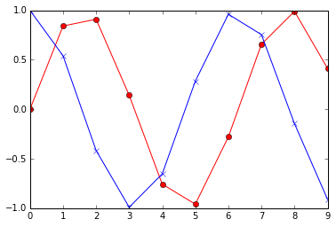

```python
%matplotlib inline
import numpy as np
import matplotlib.pyplot as plt
```


```python
import warnings
warnings.filterwarnings("ignore")
```

使用 Pandas
----

`numpy` 模块是用于处理数值计算的优秀工具，但当数据有缺失或者数组里面混合了多种类型的值等等，就比较麻烦了。而`pandas`这个模块就适合这些情况，该模块提供了类似 R 语言的数据结构 dataframe，此外还有很多各种常用的统计分析工具。`pandas`模块还提供了个很多方法能用来导入和操作数据，本节就讲一下这方面的用法。


```python
import pandas as pd
import statsmodels.api as sm
from pandas import Series, DataFrame, Panel
from string import ascii_lowercase as letters
from scipy.stats import chisqprob
import pymc
```

### 序列 Series

Series 是一个一维的数组，带有数轴标签（axis labels）。


```python
# 创建一个 series 然后提取元素

xs = Series(np.arange(10), index=tuple(letters[:10]))
print xs[:3],'\n'
print xs[7:], '\n'
print xs[::3], '\n'
print xs[['d', 'f', 'h']], '\n'
print xs.d, xs.f, xs.h
```

    a    0
    b    1
    c    2
    dtype: int64 
    
    h    7
    i    8
    j    9
    dtype: int64 
    
    a    0
    d    3
    g    6
    j    9
    dtype: int64 
    
    d    3
    f    5
    h    7
    dtype: int64 
    
    3 5 7


```python
# 所有的 numpy 函数都可以用来处理 Series 对象，然后返回一个新的 Series

y1, y2 = np.mean(xs), np.var(xs)
y1, y2
```


    (4.5, 8.25)


```python
# Matplotlib 也可以用于 Series 对象
plt.plot(xs, np.sin(xs), 'r-o', xs, np.cos(xs), 'b-x');
```





```python
# 将 Series 中的值转换成 numpy 数组

print xs.values
```

    [0 1 2 3 4 5 6 7 8 9]


```python
# Series 这种数据类型还可以用来表示时间序列（time series）

import datetime as dt
from pandas import date_range

today = dt.date.today()
print today, '\n'
days = date_range(today, periods=35, freq='D')
ts = Series(np.random.normal(10, 1, len(days)), index=days)
            
# 导出元素
print ts[0:4], '\n'
print ts['2014-06-02':'2014-06-05'], '\n' # Note - includes end time
```

    2014-06-07 
    
    2014-06-07    10.264177
    2014-06-08     9.054976
    2014-06-09     9.172518
    2014-06-10     9.182699
    Freq: D, dtype: float64 
    
    Series([], dtype: float64) 
    


```python
# 对一个时间段，我们可以通过重新取样的方式生成统计信息
# 比如, 假设我们对周平均(weekly means), 标准方差(standard deviations)和平方和(sum-of-squares)感兴趣


df = ts.resample(rule='W', how=('mean', 'std', lambda x: sum(x*x)))
df
```

<table border="1" class="dataframe">
  <thead>
    <tr style="text-align: right;">
      <th></th>
      <th>mean</th>
      <th>std</th>
      <th>&lt;lambda&gt;</th>
    </tr>
  </thead>
  <tbody>
    <tr>
      <th>2014-06-08</th>
      <td>  9.659576</td>
      <td> 0.855034</td>
      <td> 187.345908</td>
    </tr>
    <tr>
      <th>2014-06-15</th>
      <td>  9.524510</td>
      <td> 0.628514</td>
      <td> 637.384239</td>
    </tr>
    <tr>
      <th>2014-06-22</th>
      <td> 10.384550</td>
      <td> 0.632345</td>
      <td> 757.271374</td>
    </tr>
    <tr>
      <th>2014-06-29</th>
      <td>  9.746513</td>
      <td> 0.688663</td>
      <td> 667.807156</td>
    </tr>
    <tr>
      <th>2014-07-06</th>
      <td>  9.255272</td>
      <td> 1.075470</td>
      <td> 606.560178</td>
    </tr>
    <tr>
      <th>2014-07-13</th>
      <td> 10.285790</td>
      <td> 0.919888</td>
      <td> 532.372157</td>
    </tr>
  </tbody>
</table>


### DataFrame

针对统计学家，Pandas 提供了一个类似 R 语言里面的 dataframe 对象的 DataFrame。对于其他人，比如可能需要简单处理一下表格之类的，也可以使用 DataFrame。DataFrame的每一列都是一个 Series 对象。


```python
# 注意这里的 df 是之前已经定义好的一个 DataFrame
print type(df)
```

    <class 'pandas.core.frame.DataFrame'>


```python
# 对列进行重命名
# 使用 mean 和 std 就可能导致问题了，因为DataFrame里面内置了一些方法就用了这些名字
# 此外 <lambda> 也是唯一的（unifnormative）
# 所以我们就得给df中的各个列起一些更好的名字了：

df.columns = ('mu', 'sigma', 'sum_of_sq')
print df
```

                       mu     sigma   sum_of_sq
    2014-06-08   9.659576  0.855034  187.345908
    2014-06-15   9.524510  0.628514  637.384239
    2014-06-22  10.384550  0.632345  757.271374
    2014-06-29   9.746513  0.688663  667.807156
    2014-07-06   9.255272  1.075470  606.560178
    2014-07-13  10.285790  0.919888  532.372157


```python
# 从一个 DataFrame 中提取列

print df.mu, '\n' # 通过属性的方式
print df['sigma'], '\n' # 通过列名的方式
```

    2014-06-08     9.659576
    2014-06-15     9.524510
    2014-06-22    10.384550
    2014-06-29     9.746513
    2014-07-06     9.255272
    2014-07-13    10.285790
    Freq: W-SUN, Name: mu, dtype: float64 
    
    2014-06-08    0.855034
    2014-06-15    0.628514
    2014-06-22    0.632345
    2014-06-29    0.688663
    2014-07-06    1.075470
    2014-07-13    0.919888
    Freq: W-SUN, Name: sigma, dtype: float64 
    


```python
# 从一个 DataFrame中提取行

print df[1:3], '\n'
print df['2014-06-15'::2]
```

                      mu     sigma   sum_of_sq
    2014-06-15   9.52451  0.628514  637.384239
    2014-06-22  10.38455  0.632345  757.271374 
    
                       mu     sigma   sum_of_sq
    2014-06-15   9.524510  0.628514  637.384239
    2014-06-29   9.746513  0.688663  667.807156
    2014-07-13  10.285790  0.919888  532.372157


```python
# 提取块（blocks）和标量（scalars）

print df.iat[2, 2], '\n' # 使用 iat()来提取某个元素
print df.loc['2014-06-08':'2014-06-22', 'sum_of_sq'], '\n' # 通过 label 进行检索
print df.iloc[:3, 2], '\n'  # 通过位置检索
print df.ix[:3, 'sum_of_sq'], '\n' # 使用标签（label） 或者位置 （position）
```

    757.271373825 
    
    2014-06-08    187.345908
    2014-06-15    637.384239
    2014-06-22    757.271374
    Freq: W-SUN, Name: sum_of_sq, dtype: float64 
    
    2014-06-08    187.345908
    2014-06-15    637.384239
    2014-06-22    757.271374
    Freq: W-SUN, Name: sum_of_sq, dtype: float64 
    
    2014-06-08    187.345908
    2014-06-15    637.384239
    2014-06-22    757.271374
    Freq: W-SUN, Name: sum_of_sq, dtype: float64 
    


```python
# 使用布尔条件（Boolean conditions）来选择元素

print df[(df.sigma < 1) & (df.sum_of_sq < 700)], '\n' # 这里加括号是为了保证运算顺序，否则就要优先运算其他运算符了
print df.query('sigma < 1 and sum_of_sq < 700') # 这里的 query() 方法允许使用可读性更好的查询字符串
```

                       mu     sigma   sum_of_sq
    2014-06-08   9.659576  0.855034  187.345908
    2014-06-15   9.524510  0.628514  637.384239
    2014-06-29   9.746513  0.688663  667.807156
    2014-07-13  10.285790  0.919888  532.372157 
    
                       mu     sigma   sum_of_sq
    2014-06-08   9.659576  0.855034  187.345908
    2014-06-15   9.524510  0.628514  637.384239
    2014-06-29   9.746513  0.688663  667.807156
    2014-07-13  10.285790  0.919888  532.372157


### Panels

Panels 类似三维数组 3D arrays - 可以理解成由 DataFrame 构成的字典


```python
df= np.random.binomial(100, 0.95, (9,2))
dm = np.random.binomial(100, 0.9, [12,2])
dff = DataFrame(df, columns = ['Physics', 'Math'])
dfm = DataFrame(dm, columns = ['Physics', 'Math'])
score_panel = Panel({'Girls': dff, 'Boys': dfm})
print score_panel, '\n'
```

    <class 'pandas.core.panel.Panel'>
    Dimensions: 2 (items) x 12 (major_axis) x 2 (minor_axis)
    Items axis: Boys to Girls
    Major_axis axis: 0 to 11
    Minor_axis axis: Physics to Math 
    


```python
score_panel['Girls'].transpose()
```


<div style="max-height:100px;max-width:150px;overflow:auto;">
<table border="1">
  <thead>
    <tr style="text-align: right;">
      <th></th>
      <th>0</th>
      <th>1</th>
      <th>2</th>
      <th>3</th>
      <th>4</th>
      <th>5</th>
      <th>6</th>
      <th>7</th>
      <th>8</th>
      <th>9</th>
      <th>10</th>
      <th>11</th>
    </tr>
  </thead>
  <tbody>
    <tr>
      <th>Physics</th>
      <td> 97</td>
      <td> 94</td>
      <td> 91</td>
      <td> 95</td>
      <td> 93</td>
      <td> 94</td>
      <td> 92</td>
      <td> 95</td>
      <td> 95</td>
      <td>NaN</td>
      <td>NaN</td>
      <td>NaN</td>
    </tr>
    <tr>
      <th>Math</th>
      <td> 93</td>
      <td> 94</td>
      <td> 96</td>
      <td> 95</td>
      <td> 90</td>
      <td> 96</td>
      <td> 94</td>
      <td> 95</td>
      <td> 98</td>
      <td>NaN</td>
      <td>NaN</td>
      <td>NaN</td>
    </tr>
  </tbody>
</table>
</div>


```python
# 找出女生中数学的分数大于等于93的女孩的物理和数学分数
# 返回的就是一个DataFrame
score_panel.ix['Girls', score_panel.Girls.Math >= 93, :]
```


<div style="max-height:1000px;max-width:1500px;overflow:auto;">
<table border="1" class="dataframe">
  <thead>
    <tr style="text-align: right;">
      <th></th>
      <th>Physics</th>
      <th>Math</th>
    </tr>
  </thead>
  <tbody>
    <tr>
      <th>0</th>
      <td> 97</td>
      <td> 93</td>
    </tr>
    <tr>
      <th>1</th>
      <td> 94</td>
      <td> 94</td>
    </tr>
    <tr>
      <th>2</th>
      <td> 91</td>
      <td> 96</td>
    </tr>
    <tr>
      <th>3</th>
      <td> 95</td>
      <td> 95</td>
    </tr>
    <tr>
      <th>5</th>
      <td> 94</td>
      <td> 96</td>
    </tr>
    <tr>
      <th>6</th>
      <td> 92</td>
      <td> 94</td>
    </tr>
    <tr>
      <th>7</th>
      <td> 95</td>
      <td> 95</td>
    </tr>
    <tr>
      <th>8</th>
      <td> 95</td>
      <td> 98</td>
    </tr>
  </tbody>
</table>
</div>


### 拆分-应用-合并（Split-Apply-Combine）

很多统计摘要信息（statistical summaries）都是根据某些性质进行拆分，然后对各个子组应用某个函数，最终把结果组合成某种形式。这就叫做 拆分-应用-合并模型，在 Pandas 中可以通过 groupby() 以及可以用于每个子组的函数来实现。


```python
# 首先导入一个 DataFrame
try:
    tips = pd.read_pickle('tips.pic')
except:
    tips = pd.read_csv('https://raw.github.com/vincentarelbundock/Rdatasets/master/csv/reshape2/tips.csv')
    tips.to_pickle('tips.pic')
```


```python
tips.head(n=4)
```


<div style="max-height:1000px;max-width:1500px;overflow:auto;">
<table border="1" class="dataframe">
  <thead>
    <tr style="text-align: right;">
      <th></th>
      <th>Unnamed: 0</th>
      <th>total_bill</th>
      <th>tip</th>
      <th>sex</th>
      <th>smoker</th>
      <th>day</th>
      <th>time</th>
      <th>size</th>
    </tr>
  </thead>
  <tbody>
    <tr>
      <th>0</th>
      <td> 1</td>
      <td> 16.99</td>
      <td> 1.01</td>
      <td> Female</td>
      <td> No</td>
      <td> Sun</td>
      <td> Dinner</td>
      <td> 2</td>
    </tr>
    <tr>
      <th>1</th>
      <td> 2</td>
      <td> 10.34</td>
      <td> 1.66</td>
      <td>   Male</td>
      <td> No</td>
      <td> Sun</td>
      <td> Dinner</td>
      <td> 3</td>
    </tr>
    <tr>
      <th>2</th>
      <td> 3</td>
      <td> 21.01</td>
      <td> 3.50</td>
      <td>   Male</td>
      <td> No</td>
      <td> Sun</td>
      <td> Dinner</td>
      <td> 3</td>
    </tr>
    <tr>
      <th>3</th>
      <td> 4</td>
      <td> 23.68</td>
      <td> 3.31</td>
      <td>   Male</td>
      <td> No</td>
      <td> Sun</td>
      <td> Dinner</td>
      <td> 2</td>
    </tr>
  </tbody>
</table>
</div>


```python
# 第一列多了额外的一个索引列，把它删掉

tips = tips.ix[:, 1:]
tips.head(n=4)
```


<div style="max-height:1000px;max-width:1500px;overflow:auto;">
<table border="1" class="dataframe">
  <thead>
    <tr style="text-align: right;">
      <th></th>
      <th>total_bill</th>
      <th>tip</th>
      <th>sex</th>
      <th>smoker</th>
      <th>day</th>
      <th>time</th>
      <th>size</th>
    </tr>
  </thead>
  <tbody>
    <tr>
      <th>0</th>
      <td> 16.99</td>
      <td> 1.01</td>
      <td> Female</td>
      <td> No</td>
      <td> Sun</td>
      <td> Dinner</td>
      <td> 2</td>
    </tr>
    <tr>
      <th>1</th>
      <td> 10.34</td>
      <td> 1.66</td>
      <td>   Male</td>
      <td> No</td>
      <td> Sun</td>
      <td> Dinner</td>
      <td> 3</td>
    </tr>
    <tr>
      <th>2</th>
      <td> 21.01</td>
      <td> 3.50</td>
      <td>   Male</td>
      <td> No</td>
      <td> Sun</td>
      <td> Dinner</td>
      <td> 3</td>
    </tr>
    <tr>
      <th>3</th>
      <td> 23.68</td>
      <td> 3.31</td>
      <td>   Male</td>
      <td> No</td>
      <td> Sun</td>
      <td> Dinner</td>
      <td> 2</td>
    </tr>
  </tbody>
</table>
</div>


```python
# 要尝试 拆分-应用-合并模型，咱们可以试试看一下性别与是否吸烟的关系。
# 换句话说，就是根据性别和是否吸烟，拆分成 2*2 的小组，然后针对每个组来使用 size 函数来统计其中成员的个数
# 最后合并结果，成为一个新的多索引序列（multi-index Series）

grouped = tips.groupby(['sex', 'smoker'])
grouped.size()
```


    sex     smoker
    Female  No        54
            Yes       33
    Male    No        97
            Yes       60
    dtype: int64


```python
# 如果生成的结果不只有一列，那就会返回一个 DataFrame了

grouped.mean()
```


<div style="max-height:1000px;max-width:1500px;overflow:auto;">
<table border="1" class="dataframe">
  <thead>
    <tr style="text-align: right;">
      <th></th>
      <th></th>
      <th>total_bill</th>
      <th>tip</th>
      <th>size</th>
    </tr>
    <tr>
      <th>sex</th>
      <th>smoker</th>
      <th></th>
      <th></th>
      <th></th>
    </tr>
  </thead>
  <tbody>
    <tr>
      <th rowspan="2" valign="top">Female</th>
      <th>No</th>
      <td> 18.105185</td>
      <td> 2.773519</td>
      <td> 2.592593</td>
    </tr>
    <tr>
      <th>Yes</th>
      <td> 17.977879</td>
      <td> 2.931515</td>
      <td> 2.242424</td>
    </tr>
    <tr>
      <th rowspan="2" valign="top">Male</th>
      <th>No</th>
      <td> 19.791237</td>
      <td> 3.113402</td>
      <td> 2.711340</td>
    </tr>
    <tr>
      <th>Yes</th>
      <td> 22.284500</td>
      <td> 3.051167</td>
      <td> 2.500000</td>
    </tr>
  </tbody>
</table>
</div>


```python
# 返回来的结果还可以通过 apply() 来进行更多操作
# 例如，假设账单和小费都是用美元的，但我们想转换成欧元

import json
import urllib

# get current conversion rate
converter = json.loads(urllib.urlopen('http://rate-exchange.appspot.com/currency?from=USD&to=EUR').read())
print converter
grouped['total_bill', 'tip'].mean().apply(lambda x: x*converter['rate'])
```

    {u'to': u'EUR', u'rate': 0.732896, u'from': u'USD'}


<div style="max-height:1000px;max-width:1500px;overflow:auto;">
<table border="1" class="dataframe">
  <thead>
    <tr style="text-align: right;">
      <th></th>
      <th></th>
      <th>total_bill</th>
      <th>tip</th>
    </tr>
    <tr>
      <th>sex</th>
      <th>smoker</th>
      <th></th>
      <th></th>
    </tr>
  </thead>
  <tbody>
    <tr>
      <th rowspan="2" valign="top">Female</th>
      <th>No</th>
      <td> 13.269218</td>
      <td> 2.032701</td>
    </tr>
    <tr>
      <th>Yes</th>
      <td> 13.175915</td>
      <td> 2.148496</td>
    </tr>
    <tr>
      <th rowspan="2" valign="top">Male</th>
      <th>No</th>
      <td> 14.504919</td>
      <td> 2.281800</td>
    </tr>
    <tr>
      <th>Yes</th>
      <td> 16.332221</td>
      <td> 2.236188</td>
    </tr>
  </tbody>
</table>
</div>


```python
# 此外还可以对原始数据进行变换，使之更加适用于做各种分析使用
# 例如，假设我们想要对全部的账单和小费的单位进行标准化

zscore = lambda x: (x - x.mean())/x.std()

std_grouped = grouped['total_bill', 'tip'].transform(zscore)
std_grouped.head(n=4)
```


<div style="max-height:1000px;max-width:1500px;overflow:auto;">
<table border="1" class="dataframe">
  <thead>
    <tr style="text-align: right;">
      <th></th>
      <th>total_bill</th>
      <th>tip</th>
    </tr>
  </thead>
  <tbody>
    <tr>
      <th>0</th>
      <td>-0.153049</td>
      <td>-1.562813</td>
    </tr>
    <tr>
      <th>1</th>
      <td>-1.083042</td>
      <td>-0.975727</td>
    </tr>
    <tr>
      <th>2</th>
      <td> 0.139661</td>
      <td> 0.259539</td>
    </tr>
    <tr>
      <th>3</th>
      <td> 0.445623</td>
      <td> 0.131984</td>
    </tr>
  </tbody>
</table>
</div>


```python
# 假如我们只想对其中某些列来应用某一系列的函数：

grouped['total_bill', 'tip'].agg(['mean', 'min', 'max'])
```


<div style="max-height:1000px;max-width:1500px;overflow:auto;">
<table border="1" class="dataframe">
  <thead>
    <tr>
      <th></th>
      <th></th>
      <th colspan="3" halign="left">total_bill</th>
      <th colspan="3" halign="left">tip</th>
    </tr>
    <tr>
      <th></th>
      <th></th>
      <th>mean</th>
      <th>min</th>
      <th>max</th>
      <th>mean</th>
      <th>min</th>
      <th>max</th>
    </tr>
    <tr>
      <th>sex</th>
      <th>smoker</th>
      <th></th>
      <th></th>
      <th></th>
      <th></th>
      <th></th>
      <th></th>
    </tr>
  </thead>
  <tbody>
    <tr>
      <th rowspan="2" valign="top">Female</th>
      <th>No</th>
      <td> 18.105185</td>
      <td> 7.25</td>
      <td> 35.83</td>
      <td> 2.773519</td>
      <td> 1.00</td>
      <td>  5.2</td>
    </tr>
    <tr>
      <th>Yes</th>
      <td> 17.977879</td>
      <td> 3.07</td>
      <td> 44.30</td>
      <td> 2.931515</td>
      <td> 1.00</td>
      <td>  6.5</td>
    </tr>
    <tr>
      <th rowspan="2" valign="top">Male</th>
      <th>No</th>
      <td> 19.791237</td>
      <td> 7.51</td>
      <td> 48.33</td>
      <td> 3.113402</td>
      <td> 1.25</td>
      <td>  9.0</td>
    </tr>
    <tr>
      <th>Yes</th>
      <td> 22.284500</td>
      <td> 7.25</td>
      <td> 50.81</td>
      <td> 3.051167</td>
      <td> 1.00</td>
      <td> 10.0</td>
    </tr>
  </tbody>
</table>
</div>


```python
# 我们也可以在特定的列上应用特定的函数
df = grouped.agg({'total_bill': (min, max), 'tip': sum})
df
```


<div style="max-height:1000px;max-width:1500px;overflow:auto;">
<table border="1" class="dataframe">
  <thead>
    <tr>
      <th></th>
      <th></th>
      <th>tip</th>
      <th colspan="2" halign="left">total_bill</th>
    </tr>
    <tr>
      <th></th>
      <th></th>
      <th>sum</th>
      <th>min</th>
      <th>max</th>
    </tr>
    <tr>
      <th>sex</th>
      <th>smoker</th>
      <th></th>
      <th></th>
      <th></th>
    </tr>
  </thead>
  <tbody>
    <tr>
      <th rowspan="2" valign="top">Female</th>
      <th>No</th>
      <td> 149.77</td>
      <td> 7.25</td>
      <td> 35.83</td>
    </tr>
    <tr>
      <th>Yes</th>
      <td>  96.74</td>
      <td> 3.07</td>
      <td> 44.30</td>
    </tr>
    <tr>
      <th rowspan="2" valign="top">Male</th>
      <th>No</th>
      <td> 302.00</td>
      <td> 7.51</td>
      <td> 48.33</td>
    </tr>
    <tr>
      <th>Yes</th>
      <td> 183.07</td>
      <td> 7.25</td>
      <td> 50.81</td>
    </tr>
  </tbody>
</table>
</div>


### 使用`statsmodels`

在 R 语言中提供的很多基本的统计学工具都有替代版本，位于`statsmodels`这个包中。这里我们只给出一个例子。


```python
# 在使用加性遗传模型（additive genetic model）的对照研究（case-control study）中模拟4 SNP的基因型（genotype）

n = 1000
status = np.random.choice([0,1], n )
genotype = np.random.choice([0,1,2], (n,4))
genotype[status==0] = np.random.choice([0,1,2], (sum(status==0), 4), p=[0.33, 0.33, 0.34])
genotype[status==1] = np.random.choice([0,1,2], (sum(status==1), 4), p=[0.2, 0.3, 0.5])
df = DataFrame(np.hstack([status[:, np.newaxis], genotype]), columns=['status', 'SNP1', 'SNP2', 'SNP3', 'SNP4'])
df.head(6)
```


<div style="max-height:1000px;max-width:1500px;overflow:auto;">
<table border="1" class="dataframe">
  <thead>
    <tr style="text-align: right;">
      <th></th>
      <th>status</th>
      <th>SNP1</th>
      <th>SNP2</th>
      <th>SNP3</th>
      <th>SNP4</th>
    </tr>
  </thead>
  <tbody>
    <tr>
      <th>0</th>
      <td> 1</td>
      <td> 2</td>
      <td> 1</td>
      <td> 2</td>
      <td> 0</td>
    </tr>
    <tr>
      <th>1</th>
      <td> 0</td>
      <td> 1</td>
      <td> 0</td>
      <td> 2</td>
      <td> 1</td>
    </tr>
    <tr>
      <th>2</th>
      <td> 0</td>
      <td> 1</td>
      <td> 1</td>
      <td> 0</td>
      <td> 0</td>
    </tr>
    <tr>
      <th>3</th>
      <td> 0</td>
      <td> 0</td>
      <td> 0</td>
      <td> 2</td>
      <td> 0</td>
    </tr>
    <tr>
      <th>4</th>
      <td> 1</td>
      <td> 2</td>
      <td> 2</td>
      <td> 2</td>
      <td> 2</td>
    </tr>
    <tr>
      <th>5</th>
      <td> 0</td>
      <td> 2</td>
      <td> 1</td>
      <td> 2</td>
      <td> 1</td>
    </tr>
  </tbody>
</table>
</div>


```python
# 使用 statsmodels 来对数据进行逻辑回归拟合
fit1 = sm.Logit.from_formula('status ~ %s' % '+'.join(df.columns[1:]), data=df).fit()
fit1.summary()
```

    Optimization terminated successfully.
             Current function value: 0.642435
             Iterations 5


<table class="simpletable">
<caption>Logit Regression Results</caption>
<tr>
  <th>Dep. Variable:</th>      <td>status</td>      <th>  No. Observations:  </th>  <td>  1000</td>  
</tr>
<tr>
  <th>Model:</th>               <td>Logit</td>      <th>  Df Residuals:      </th>  <td>   995</td>  
</tr>
<tr>
  <th>Method:</th>               <td>MLE</td>       <th>  Df Model:          </th>  <td>     4</td>  
</tr>
<tr>
  <th>Date:</th>          <td>Sat, 07 Jun 2014</td> <th>  Pseudo R-squ.:     </th>  <td>0.07198</td> 
</tr>
<tr>
  <th>Time:</th>              <td>18:32:56</td>     <th>  Log-Likelihood:    </th> <td> -642.43</td> 
</tr>
<tr>
  <th>converged:</th>           <td>True</td>       <th>  LL-Null:           </th> <td> -692.26</td> 
</tr>
<tr>
  <th> </th>                      <td> </td>        <th>  LLR p-value:       </th> <td>1.162e-20</td>
</tr>
</table>
<table class="simpletable">
<tr>
      <td></td>         <th>coef</th>     <th>std err</th>      <th>z</th>      <th>P>|z|</th> <th>[95.0% Conf. Int.]</th> 
</tr>
<tr>
  <th>Intercept</th> <td>   -1.7260</td> <td>    0.205</td> <td>   -8.410</td> <td> 0.000</td> <td>   -2.128    -1.324</td>
</tr>
<tr>
  <th>SNP1</th>      <td>    0.3180</td> <td>    0.084</td> <td>    3.773</td> <td> 0.000</td> <td>    0.153     0.483</td>
</tr>
<tr>
  <th>SNP2</th>      <td>    0.4374</td> <td>    0.083</td> <td>    5.282</td> <td> 0.000</td> <td>    0.275     0.600</td>
</tr>
<tr>
  <th>SNP3</th>      <td>    0.4106</td> <td>    0.082</td> <td>    4.983</td> <td> 0.000</td> <td>    0.249     0.572</td>
</tr>
<tr>
  <th>SNP4</th>      <td>    0.4061</td> <td>    0.083</td> <td>    4.910</td> <td> 0.000</td> <td>    0.244     0.568</td>
</tr>
</table>


```python
# 改用广义线性模型（GLM） - 跟 R 很相似
fit2 = sm.GLM.from_formula('status ~ SNP1 + SNP2 + SNP3 + SNP4', data=df, family=sm.families.Binomial()).fit()
print fit2.summary()
print chisqprob(fit2.null_deviance - fit2.deviance, fit2.df_model)
print(fit2.null_deviance - fit2.deviance, fit2.df_model)
```

                     Generalized Linear Model Regression Results                  
    ==============================================================================
    Dep. Variable:                 status   No. Observations:                 1000
    Model:                            GLM   Df Residuals:                      995
    Model Family:                Binomial   Df Model:                            4
    Link Function:                  logit   Scale:                             1.0
    Method:                          IRLS   Log-Likelihood:                -642.43
    Date:                Sat, 07 Jun 2014   Deviance:                       1284.9
    Time:                        18:32:57   Pearson chi2:                     997.
    No. Iterations:                     5                                         
    ==============================================================================
                     coef    std err          t      P>|t|      [95.0% Conf. Int.]
    ------------------------------------------------------------------------------
    Intercept     -1.7260      0.205     -8.410      0.000        -2.128    -1.324
    SNP1           0.3180      0.084      3.773      0.000         0.153     0.483
    SNP2           0.4374      0.083      5.282      0.000         0.275     0.600
    SNP3           0.4106      0.082      4.983      0.000         0.249     0.572
    SNP4           0.4061      0.083      4.910      0.000         0.244     0.568
    ==============================================================================
    1.16166631397e-20
    (99.660679649809936, 4)


## 在 IPython 中使用 R 语言

Python 对统计计算的支持正在迅速增强（尤其是有 pandas，statsmodels 和 scikit-learn 这些模块），但 R 语言的生态系统依然是更加巨大的。不过目前我们也能对R进行一些利用，因为 IPython 里面可以允许几乎无缝地运行 R 语言，这里要借助的是Rmagic (rpy2.ipython) 扩展。

有两种使用 Rmagic 的方式，一种是%R ，针对单行；另一种是%%R，针对整个 cell。Python 的对象可以通过加上 -i 的标识参数传递给 R语言，而R 语言对象可以使用 -o 的标识参数来传出。


```python
%load_ext rpy2.ipython
```


```python
%%R -i df -o fit

fit <- glm(status ~ ., data=df)
print(summary(fit))
print(fit$null.deviance - fit$deviance)
print(fit$df.null - fit$df.residual)
with(fit, pchisq(null.deviance - deviance, df.null - df.residual, lower.tail = FALSE))
```


    
    Call:
    glm(formula = status ~ ., data = df)
    
    Deviance Residuals: 
        Min       1Q   Median       3Q      Max  
    -0.8252  -0.4641   0.1748   0.4420   0.8228  
    
    Coefficients:
                Estimate Std. Error t value Pr(>|t|)    
    (Intercept)  0.10446    0.04370   2.390 0.017026 *  
    SNP1         0.07275    0.01907   3.814 0.000145 ***
    SNP2         0.10046    0.01864   5.389 8.83e-08 ***
    SNP3         0.09394    0.01851   5.075 4.63e-07 ***
    SNP4         0.09320    0.01866   4.996 6.92e-07 ***
    ---
    Signif. codes:  0 ‘***’ 0.001 ‘**’ 0.01 ‘*’ 0.05 ‘.’ 0.1 ‘ ’ 1
    
    (Dispersion parameter for gaussian family taken to be 0.2268342)
    
        Null deviance: 249.56  on 999  degrees of freedom
    Residual deviance: 225.70  on 995  degrees of freedom
    AIC: 1361.3
    
    Number of Fisher Scoring iterations: 2
    
    [1] 23.85901
    [1] 4
    [1] 8.524408e-05


```python
%load_ext version_information

%version_information numpy, matplotlib, pandas, statsmodels
```
