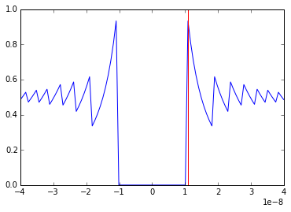

```python
%matplotlib inline
import matplotlib.pyplot as plt
import numpy as np
%precision 4
import os, sys, glob
np.random.seed(1)
```

# 计算机中的数值和数学（Computer numbers and mathematics）


本课程中，我们只会用到固定小数点的数值（也就是整数）以及小数点浮动的数值（即浮点数，这里是一切实数）。因为计算机对数值的表示是有限的，所以计算机中的数只是对整数环（integer ring）和数学中实数域（real field of mathematics）的一个近似。本节中的内容只是一小部分比较重要的，这些内容希望学习者一定要记住，避免以后使用的时候遇到意想不到的错误结果。

**参考文献**

* <https://docs.python.org/2/tutorial/floatingpoint.html>
* <http://introcs.cs.princeton.edu/java/lectures/9scientific.pdf>
* <http://www.johndcook.com/blog/2008/09/28/theoretical-explanation-for-numerical-results/>
* <http://www.johndcook.com/blog/2008/09/26/comparing-three-methods-of-computing-standard-deviation/>
* <http://www.johndcook.com/blog/2008/10/20/comparing-two-ways-to-fit-a-line-to-data/>
* <http://www.johndcook.com/blog/2008/11/05/how-to-calculate-pearson-correlation-accurately/>

错误使用数值的一些样例（Some examples of numbers behaving badly）
----

### 归一化权值（Normalizing weights）

给定一系列的权值，我们希望把这些值进行归一化，让总和 sum = 1。
（译者注：这里原课程用的是Python2，在2 当中，int整数直接使用单斜杠/ 的除法是不取余数只有整数位的，也就是相当于3 当中的地板除法//，而在 Python3 里面，int直接使用单斜杠/ 的除法来计算的结果会和浮点数一样，下面的样例也就不会都是0了，大家自己在 Pyhon3 和 2里面对比一下吧。）


```python
def normalize(ws):
    """Returns normalized set of weights that sum to 1."""
    s = sum(ws)
    return [w/s for w in ws]
```


```python
ws = [1,2,3,4,5]
normalize(ws)
```


    [0, 0, 0, 0, 0]


### 相似度比较（likelihoods）

Assuming indepdnece, the likelihood of observing some data points given a distributional model for each data point is the product of the likelihood for each data point.

假设数据是独立分布的，给出每个数据点都有分布模型的一组数据点，这些数据点的相似度是每个数据点的可能性的乘积。


```python
from scipy.stats import norm

rv1 = norm(0, 1) #译者注: 使用正态分布
rv2 = norm(0, 3)

xs = np.random.normal(0, 3, 1000)
likelihood1 = np.prod(rv1.pdf(xs)) #译者注: 使用概率密度函数，probability density function
likelihood2 = np.prod(rv2.pdf(xs))
likelihood2 > likelihood1
```


    False


### 等式比较（Equality comparisons）

We use an equality condition to exit some loop.

使用等式条件来判断跳出循环。


```python
s = 0.0

for i in range(1000):
    s += 1.0/10.0
    if s == 1.0:
        break
print i
```

    999


### 方差计算（Calculating variance）

$$
s^2 = \frac{\sum_{i=1}^{n} x_i^2 - (\sum_{i=1}^n x_i)^2/n}{n-1}
$$


```python
def var(xs):
    """返回样本数据的方差"""
    n = 0
    s = 0
    ss = 0
    
    for x in xs:
        n +=1
        s += x
        ss += x*x

    v = (ss - (s*s)/n)/(n-1)
    return v
```


```python
# 从方差为1的正态分布中的取出来的数字样本的方差是多少？

np.random.seed(4)
xs = np.random.normal(1e9, 1, 1000)
var(xs)
```


    -262.4064


## 对数值的有限表示（Finite representation of numbers）

对于整数，不同的编程语言都有各自能表示的最大和最小值。Python的整数实际上是对象，所以在你超过了这些限制之后整数对象会切换到任意大精度的数值，但对于C和R语言来说则都不是这样。在 64位的体系中，最大值是 `2^63 - 1`，最小值是 `-2^63 - 1`。


```python
import sys
sys.maxint
```


    9223372036854775807


```python
2**63-1 == sys.maxint
```


    True


```python
# 对于整数的所谓“溢出”，Python 的处理方法就是自动转换成长整形 long，然后有无穷精度
sys.maxint + 1
```


    9223372036854775808L


### 整数除法

这个内容经常被提到，因为特别重要，而且经常容易引起bug。所以在对整数进行除法操作的时候要特别小心。下面是一些常见的情境举例。

（译者注：这门课程原版用的是Python2，所以整数除法还比较复杂麻烦，在 Python3 中问题简单多了，大家自己探索一下，千万别只学一种，而拒绝任何新的尝试或者对旧内容的探索，只要是未知，都应当保持好奇心和求知欲。）


```python
# 显式浮点数转换然后除

print float(1)/3
```

    0.333333333333


```python
# 隐式浮点数转换然后除

print (0.0 + 1)/3
print (1.0 * 1)/3
```

    0.333333333333
    0.333333333333


```python
# Telling Python to ALWAYS do floaitng point with '/'
# Integer division can still be done with '//'
# The __futre__ package contains routines that are only 
# found beyond some Python release number.

# 译者注：这个没啥意思，其实就是引入了 Python3 中的除法而已。

from __future__ import division

print (1/3)
print (1//3)
```

    0.333333333333
    0


[Documentation about the future package](https://docs.python.org/2/library/__future__.html)

### 打包的C中的溢出以及给出负值（Overflow in langauges such as C "wraps around" and gives negative numbers）


```python
%%file demo.c

#include "limits.h"

long limit() {
    return LONG_MAX;
}

long overflow() {
    long x = LONG_MAX;
    return x+1;
}
```

    Overwriting demo.c


```python
! clang -emit-llvm -c demo.c -o demo.o
```


```python
import bitey
import demo

demo.limit(), demo.overflow()
```


    (9223372036854775807, -9223372036854775808)


### 浮点数（Floating point numbers）

浮点数在存储的时候分成三部分，分别是符号位，指数和尾数（sign bit, exponent, mantissa），所有的浮点数都是通过 +/- mantissa ^ exponent 来实现的。因此，接近0、下限和上限的连续数之间的间隔最小（精度高）。


指数需要使用符号位来代表小数和大数(both small and large numbers)，但是使用无符号位的数字会更方便，因此指数有一个偏移量(也称为指数偏倚，exponent bias)。 比如说，如果指数是一个无符号的8位数字(unsigned 8-bit number)，它可以代表(0,255)这样一个范围。 如果使用128作为偏移量，那么就可以表示为(-127, 128)这个范围。


```python
from IPython.display import Image
```

#### 二进制方式表示的浮点数


```python
Image(url='http://www.dspguide.com/graphics/F_4_2.gif')
```


```python
Image(url='http://jasss.soc.surrey.ac.uk/9/4/4/fig1.jpg')
```


可以通过 `sys.float_info`来获得你的操作系统中浮点数相关的信息。关于浮点数的详细定义可以参考 <https://docs.python.org/2/library/sys.html#sys.float_info>


```python
import sys

print sys.float_info
```

    sys.float_info(max=1.7976931348623157e+308, max_exp=1024, max_10_exp=308, min=2.2250738585072014e-308, min_exp=-1021, min_10_exp=-307, dig=15, mant_dig=53, epsilon=2.220446049250313e-16, radix=2, rounds=1)


```python
# 浮点数很可能是不精确的
'%.20f' % (0.1 * 0.1 * 100)
```


    '1.00000000000000022204'


```python
# 所以一定不要用浮点数来检查是否相等

# 错误的样例：
s = 0.0

for i in range(1000):
    s += 1.0/10.0
    if s == 1.0:
        break
print i

# 正确的做法：

TOL = 1e-9
s = 0.0

for i in range(1000):
    s += 1.0/10.0
    if abs(s - 1.0) < TOL:
        break
print i
```

    999
    9


```python
# 精度损失
1 + 6.022e23 - 6.022e23
```


    0.0000


```python
# 执行加法的时候得注意，可能是不连续的？（may not be associative）
6.022e23 - 6.022e23 + 1
```


    1.0000


<font color=blue>经验：算法中要避免两个非常接近的数字相减。 当两个数字都非常大时，由于可用的精确位数有限，出现问题的概率就特别大。</font>


```python
# 在计算概率的时候这种精度损失就是个问题了
probs = np.random.random(1000)
np.prod(probs)
```


    0.0000


```python
# 在处理很多特别小的值的时候，可以使用对数函数
np.sum(np.log(probs))
```


    -980.0558


<font color=blue>经验: 特别大或者特别小的数进行运算的时候都应当使用对数，这样能降低上下溢出的概率（reduce underflow/overflow）</font>

使用无穷精度的库（arbitrary precision libraries）
----

如果相比计算速度，你更需要计算精度（比如你的代码可能上下溢出，而你又找不到或者不想去折腾一个办法），Python也提供了一些无限精度的数学库，例如：

- [The decimal package in the standard library](https://docs.python.org/2/library/decimal.html)
- [The mpmath package](http://mpmath.org)
- [The gmpy2 package](https://pypi.python.org/pypi/gmpy2)

mpmath和gmpy2这两个库都可以通过pip安装
```bash
pip install gmpy2
pip install mpmath
```

这些库可以让你对计算中使用的数值的精度进行设置。如果你要使用的话可以去读一下这些库的官方文档。

稳定性和条件状态（Stability and conditioning）
----

假如我们有一个计算机算法 $g(x)$，它表示的是一个数学函数 $f(x)$。如果对于很小的扰动 $\epsilon$，有$g(x+\epsilon) \approx f(x)$，那么就认为 $g(x)$是稳定的（stable）。


对于一个数学函数 $f(x)$ 来说，如果在$\epsilon$是一个很小的扰动的时候，有 $f(x + \epsilon) \approx f(x)$，则认为$f(x)$是条件良好的（well-conditioned）。


也就是，如果*随着问题的改变而解也逐渐改变*，那么就说这个<font color=red>函数function</font>$f(x)$ 是 **条件良好的 well-conditioned**。对于一个条件良好的数学函数，所有微小的扰动只会带来微小的变化。 然而，一个条件并不良好(pooly-conditioned)的函数，一点微小的扰动会带来巨大的变化。 例如：给一个近似奇异矩阵（nearly singular matrix）求逆矩阵就是一个条件很差的问题（poorly condiitioned problem）。

一个数学算法 $g(x)$ ，给定 $x'\approx x$，如果 $g(x) \approx f(x')$，这个 $g(x)$ 就是**数值稳定 numerically stable**的
 
也就是，如果这个算法$g(x)$能针对正确的问题给出近似正确的解（gives *nearly the right answer to nearly the right problem*），那就是**数值稳定 numerically stable**的。 数值不稳定的算法在计算机的计算过程中会放大预估的错误。 如果我们使用一个无限精度的数字系统，稳定和不稳定的算法将会有相同的精度。 然而，正如我们看到的(比如，前面检查浮点数的相等运算)，当使用浮点数时，数学上的等式会带来不同的结果。

**不稳定的情况（Unstable version）**


```python
# 灾难性消除（Catastrophic cancellation）会在两个值非常接近的数值相减的时候发生
# 下面这个是另外一种情况的例子

def f(x):
    return (1 - np.cos(x))/(x*x)
```


```python
x = np.linspace(-4e-8, 4e-8, 100)
plt.plot(x,f(x));
plt.axvline(1.1e-8, color='red')
plt.xlim([-4e-8, 4e-8]);
```





```python
# 通过罗比塔法则（L'Hopital'）我们应该知道在0的位置正确大难应该是0.5
# 而且在其邻域内都应该非常接近0.5才对
# 但如图所示，这里就因为发生了灾难性消除，导致了错误

print '%.30f' % np.cos(1.1e-8)
print '%.30f' % (1 - np.cos(1.1e-8)) # exact answer is 6.05e-17
print '%2f' % ((1 - np.cos(1.1e-8))/(1.1e-8*1.1e-8))
```

    0.999999999999999888977697537484
    0.000000000000000111022302462516
    0.917540


**稳定版本（Stable version）**


```python
# 数值稳定的版本的函数
# 使用半角公式（long-forgotten half-angle formula from trignometry）

def f1(x):
    return 2*np.sin(x/2)**2/(x*x)
```


```python
x = np.linspace(-4e-8, 4e-8, 100)
plt.plot(x,f1(x));
plt.axvline(1.1e-8, color='red')
plt.xlim([-4e-8, 4e-8]);
```


### 方差的稳定版和不稳定版（Stable and unstable versions of variance）

$$s^2 = \frac{1}{n-1}\sum(x - \bar{x})^2$$


```python
# 平方和方法（向量版本）sum of squares method (vectorized version)
def sum_of_squers_var(x):
    n = len(x)
    return (1.0/(n*(n-1))*(n*np.sum(x**2) - (np.sum(x))**2))
```

<font color=blue>这就应该注意了 - 大数减大数!</font>


```python
# 直接计算的版本（direct method）
def direct_var(x):
    n = len(x)
    xbar = np.mean(x)
    return 1.0/(n-1)*np.sum((x - xbar)**2)
```

<font color=blue>这就好多了，毕竟是先做了差然后才平方</font>


```python
# Welford 方法
def welford_var(x):
    s = 0
    m = x[0]
    for i in range(1, len(x)):
        m += (x[i]-m)/i
        s += (x[i]-m)**2
    return s/(len(x) -1 )
```

<font color=blue>Knuth的计算机编程艺术（Art of Computer Programming）里面的经典方法</font>


```python
x_ = np.random.uniform(0,1,1e6)
x = 1e12 + x_
```


```python
# 正确结果
np.var(x_)
```


    0.0835


```python
sum_of_squers_var(x)
```


    737870500.8189


```python
direct_var(x)
```


    0.0835


```python
welford_var(x)
```


    0.0835


<font color=blue>经验:把数学公式直接转换成代码时候要小心，因为运算效果可能不一定一样！</font>

这个问题也出现在查找简单回归系数和Pearson相关系数的导航算法中。

可以查看以下一系列的清晰解释:

- http://www.johndcook.com/blog/2008/09/28/theoretical-explanation-for-numerical-results/
- http://www.johndcook.com/blog/2008/09/26/comparing-three-methods-of-computing-standard-deviation/
- http://www.johndcook.com/blog/2008/10/20/comparing-two-ways-to-fit-a-line-to-data/
- http://www.johndcook.com/blog/2008/11/05/how-to-calculate-pearson-correlation-accurately/

### 条件性差的问题（Poorly conditioned problems）


```python
# 下面这个函数的条件性就很差

x1 = 1.57078
x2 = 1.57079
t1 = np.tan(x1)
t2 = np.tan(x2)
```


```python
print 't1 =', t1
print 't2 =', t2
print '% change in x =', 100.0*(x2-x1)/x1
print '% change in tan(x) =', (100.0*(t2-t1)/t1)
```

    t1 = 61249.0085315
    t2 = 158057.913416
    % change in x = 0.000636626389427
    % change in tan(x) = 158.057913435


**病态条件矩阵（Ill-conditioned matrices）**

在这个例子里面，我们要解一个线性方程组 Ax = b ，其中的 A 和 b 都已经给出了。


```python
A = 0.5*np.array([[1,1], [1+1e-10, 1-1e-10]])
b1 = np.array([2,2])
b2 = np.array([2.01, 2])
```


```python
np.linalg.solve(A, b1)
```


    array([ 2.,  2.])


```python
np.linalg.solve(A, b2)
```


    array([-99999989.706,  99999993.726])


矩阵的条件数是一个有用的诊断工具 - 定义为A的范数与A的逆矩阵的范数的乘积。如果条件数很大，则矩阵是病态条件的。 由于有许多方法来计算矩阵的范数，所以也就有许多条件数，但对于判断矩阵是否为病态来说大概都差不多。


```python
np.linalg.cond(A)
```


    19999973849.2252


```python
np.linalg.cond(A, 'fro')
```


    19999998343.1927


<font color=blue>经验: 准确性同时取决于稳定性和条件的好坏（stability and conditioning）。</font>

#### 针对病态条件矩阵的简单处理（Simple things to try with ill-conditioned matrices）

- 看看能不能删除互相依赖的甚至共线的变量？ 如果一个变量（几乎）是另一个变量的具体的倍数，那这个变量就基本不提供其他信息，也就可以从矩阵中删除。

- 能不能对数据进行规范化，使得所有变量都处于相同规模？ 例如，如果用列表示特征值，把特征标准化为零均值和单位标准差，这样有可能有帮助。

- 尝试一下使用线性代数库里面的函数，而不是自己写。例如`scipy.linalg`中提供的`lstsq`这个最小二乘法函数，可以非常灵活地处理共线的变量。


```python
# 共线变量（Collinear variables）

n, p = 10, 6

A = np.random.random((n,p))
A[:, -1] = A[:, 0] # create dependent column
x = np.random.random(p).reshape((p, 1))
x[-1] = x[0]
b = np.dot(A, x)

import scipy.linalg as la

xhat = la.lstsq(A, b)[0]
print x.T
print xhat.T

# 使用 $A^TA x = A^Tb$ 来写你自己的版本
# 估计这样应该会失败，因为这个矩阵是一个奇异矩阵（singular）
# 或给出错误的结果（矩阵是非奇异的
# 因为浮点数的不准确性）
try:
    xhat1 = la.solve(np.dot(A.T, A), np.dot(A.T, b))
    print xhat1.T
except la.LinAlgError:
    print "Singluar matrix"
```

    [[ 0.8464  0.8527  0.6134  0.3143  0.4506  0.8464]]
    [[ 0.8464  0.8527  0.6134  0.3143  0.4506  0.8464]]
    Singluar matrix


练习
----

本章的主要内容是让你了解一下计算机中的数值作为数学上数值的一种模拟，是一种“有遗漏的抽象（leaky abstraction）”，以及可能会导致问题的一些常见情况。 一旦你了解了这些内容，就可以避免只是使用简单规则，或者还可以选择合适的数值库函数而不是自己去重新实现。 所以在本章的这些计算机计算、条件优劣判断和数值稳定性等内容，就都没有什么习题了。

此外，你需要习惯使用 numpy 里面的数组，尤其是在本课程的后续内容中。想要练习的话，可以看看下面这个链接里面的样例和练习题：

[Nicolas P. Rougier's  numpy tutorial](http://www.labri.fr/perso/nrougier/teaching/numpy/numpy.html)

像这样的 numpy 简介还有很多，大家可以多练一练！
